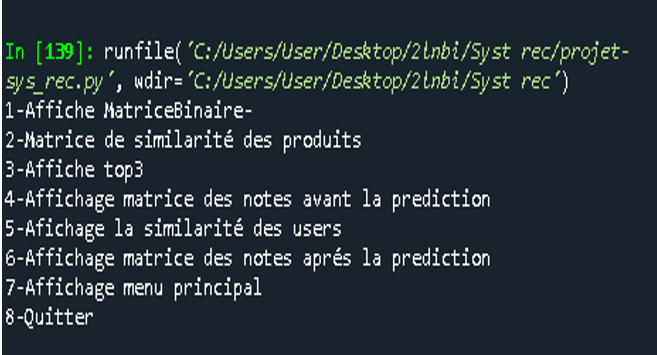
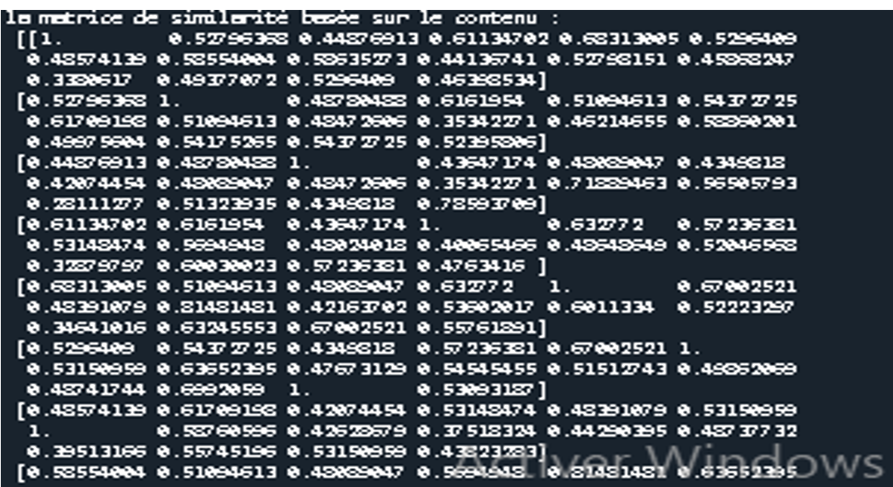

# Recommendation System

A recommendation system developed during the **2020/2021 academic year**, combining **content-based recommendation** and **collaborative filtering** techniques.

## 📌 Project Overview

The objective of this project is to build a recommendation system capable of recommending products based on:

* The **similarity between product descriptions**
* The **preferences and ratings of users**
* The similarity between users and products

The system was developed using a database containing **16 computer hardware products** and ratings provided by **10 users**.

## 🧠 Recommendation Approaches

The project implements two complementary approaches:

### 1. Content-Based Recommendation

The content-based approach recommends products according to the similarity between their descriptions.

#### Text preprocessing

The following Natural Language Processing techniques are applied:

* **Tokenization** – splitting product descriptions into individual words
* **Stemming** – reducing words to their root form
* **Stopwords removal** – removing unnecessary characters and words

For example, the word `graphics` is transformed into `graphic` during the stemming process.

#### Binary Matrix

After preprocessing the product descriptions, a binary matrix is constructed:

* `1` → the word appears in the product description
* `0` → the word does not appear

#### Product Similarity

A **Product × Product similarity matrix** is then generated using **Cosine Similarity**.

This matrix is used to identify the most similar products and generate the **Top 3 recommendations** for each product.

---

### 2. Collaborative Filtering

The second approach is based on user preferences and product ratings.

#### User-Product Rating Matrix

A **User × Product** matrix is created, containing ratings given by **10 users** to **16 products**.

#### User Similarity

A **User × User similarity matrix** is calculated using **Cosine Similarity**.

This allows the system to identify users with similar preferences.

#### Rating Prediction

When a user has not rated a particular product, the system predicts a rating based on the **two most similar users**.

The users with the highest similarity coefficients are used to estimate the missing rating.

## 🏗️ System Architecture

The recommendation pipeline can be summarized as follows:

```text
                    Product Database
                          │
                          ▼
                Product Descriptions
                          │
                          ▼
              ┌──────────────────────┐
              │  Text Preprocessing  │
              │                      │
              │  • Tokenization      │
              │  • Stemming          │
              │  • Stopwords         │
              └──────────┬───────────┘
                         │
                         ▼
                  Binary Matrix
                         │
                         ▼
                Cosine Similarity
                         │
                         ▼
              Similar Products
                         │
                         ▼
                  Top 3 Products


                    User Ratings
                         │
                         ▼
              User × Product Matrix
                         │
                         ▼
                User Similarity
                         │
                         ▼
                Cosine Similarity
                         │
                         ▼
              Most Similar Users
                         │
                         ▼
               Rating Prediction
```

## 🛠️ Technologies & Concepts

* **Python**
* **SQL**
* **Natural Language Processing (NLP)**
* **Tokenization**
* **Stemming**
* **Stopwords Removal**
* **Cosine Similarity**
* **Content-Based Filtering**
* **Collaborative Filtering**
* **Recommendation Systems**
* **Database Management**

## 📊 Dataset

The product database was generated from the **Scoop Informatique** website and contains information such as:

* Product ID
* Product name
* Color
* Product description

The database contains **16 products**.

The collaborative filtering component uses ratings from **10 users** across the 16 products.


## 🎯 Key Learning Outcomes

This project provided practical experience in:

* Designing a recommendation system
* Applying NLP preprocessing techniques to product descriptions
* Building similarity matrices
* Implementing Cosine Similarity
* Predicting missing user ratings
* Combining content-based and collaborative recommendation approaches
* Working with SQL databases

## 📷 Project Screenshots







## 📄 Project Documentation

The complete project documentation is available in this repository.

---

⭐ If you find this project interesting, feel free to explore the repository!
